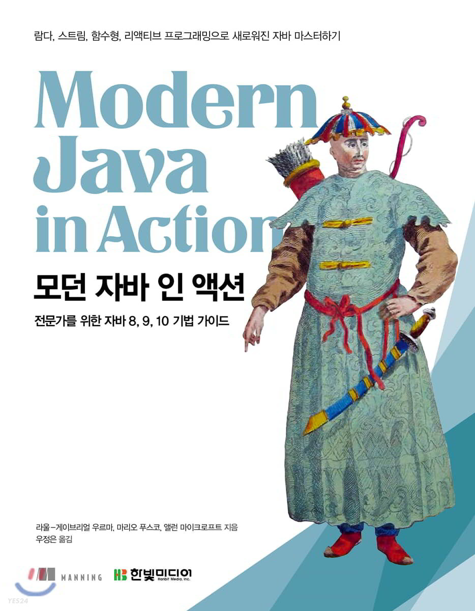

# Modern Java in Action
패스트캠퍼스 백엔드 부트캠프 5기 1조(개발자시켜조) 모던 자바 인 액션 스터디

🤔 스터디 방법
---

주차 별 정해놓은 범위를 각자 읽은 후 궁금한 점 토론할만한 주제를 
[Issues](https://github.com/Ussu1112/Modern-Java-In-Action/issues) 에 등록 (챕터별 🏷 달기!)

 

👣 주차별 진도
---

|주차|챕터|
|---|---|
|1주차|Chapter1 : 자바 8,9,10,11 : 무슨 일이 일어나고 있는가?   Chapter2 : 동작 파라미터화 코드 전달하기   Chapter3 : 람다 표현식
|2주차||

 

💻 참여자
---

|Name|Github Link|
|---|---|
|송태형|[👻](https://github.com/Ussu1112)|
|송정호|[github](https://github.com/sdfgx123)|
|선예은|[github](https://github.com/dpdmstjs)|
|정현수|[github](https://github.com/hyunsb)|
|노혜지|[github](https://github.com/HyeJiRoh)|

